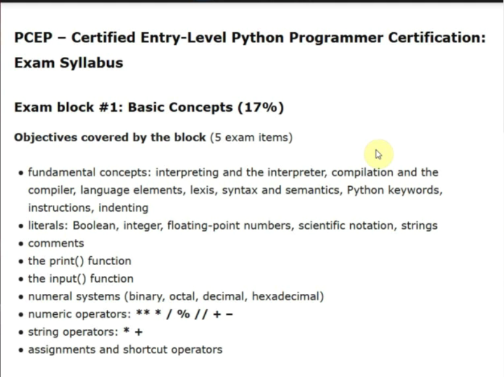

# Module 1 - Basic Concepts



---


## Summary

---

### Literals

```python

sample_boolean = True

sample_integer = 5

sample_float = 5.0

sample_scientific = 4.23e27

sample_string = 'Hello!'

```

---

### Comments

```python

# This is a comment

print('Hello!')      # print 'Hello!'

# Hello!

```

```python

print('Hello!', 'Nice to see you.')

# Hello! Nice to see you.

```

---

### input()

``` python

user_name = input('What\'s your name? ')

print(f'Hi! {user_name})

# What is your name? Fred

# Hi! Fred

```

---

### Numeral Systems

```python

sample_octal = 0o17

sample_hexadecimal = 0x123

sample_decimal = 12

# sample_binary = 00101101

```

---

### Strings Adddition

```python
msg = 'Hello'+' '+'World!'
# Hello World
```

## Strings Multiplication

```python
msg = "one" * 3
# oneoneone
```

---

## Assignments and Shortcuts

```python

age = 25

age = age + 25

age += 25

age -= 25

age *= 25

age /= 25

```

---

## Division

Division operations produce a float. Ex.: 21/7 = 3.0

### Operations

  /: simple division  
//: integer division  
%:  modulo

---
